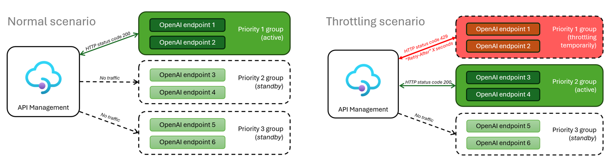

# :rocket: Smart Load Balancing for OpenAI Endpoints and Azure API Management

Many service providers, including OpenAI, set limits on API calls. Azure OpenAI, for instance, has limits on tokens per minute (TPM) and requests per minute (RPM). Exceeding these limits results in a 429 'TooManyRequests' HTTP Status code and a 'Retry-After' header, indicating a pause before the next request.

This solution incorporates a comprehensive approach, considering UX/workflow design, application resiliency, fault-handling logic, appropriate model selection, API policy configuration, logging, and monitoring. It introduces an Azure API Management Policy that seamlessly integrates a single endpoint to your applications while efficiently managing consumption across multiple OpenAI or other API backends based on their availability and priority.

## :sparkles: Smart vs. Round-Robin Load Balancers

Our solution stands out in its intelligent handling of OpenAI throttling. It is responsive to the HTTP status code 429 (Too Many Requests), a common occurrence due to rate limits in Azure OpenAI. Unlike traditional round-robin methods, our solution dynamically directs traffic to non-throttling OpenAI backends, based on a prioritized order. When a high-priority backend starts throttling, traffic is automatically rerouted to lower-priority backends until the former recovers.

### Key Features:

- **Prioritized Traffic Routing**: Implementing 'priority groups' allows for strategic consumption of quotas, prioritizing specific instances over others.

- **No Delay in Backend Switching**: Our policy ensures immediate switching to different endpoints without delay, contrary to many existing API Management sample policies that introduce waiting intervals.

### Scenarios and Priority Groups:

- **Provisioned Throughput Deployment (PTU)**: Set as Priority 1 to utilize its capacity first, given its fixed pricing model.
- **Fallback S0 Tier Deployments**: Spread across different regions, these are set as Priority 2 and beyond, used when PTU is at capacity.

In cases where multiple backends share the same priority and are all operational, our algorithm randomly selects among them.

## Content Structure

- **Manual Setup**: Step-by-step instructions for Azure API Management instance setup and policy configuration. [View Manual Setup](/docs/manual-setup.md)
- **Azure Developer CLI (azd) Setup**: Guide for using the Azure Developer CLI for simplified deployment. [View AZD Setup](/docs/azd-setup.md)
- **Understanding the Policy**: Detailed explanation of the API Management policies and their customization. [View How Policy Works](/docs/how-the-policy-works.md)
- **FAQ**: Common questions and answers about the setup and usage of this solution. [View FAQ](/docs/faq.md)

## Conclusion

This smart load balancing solution effectively addresses the challenges posed by API limit constraints in Azure OpenAI. By implementing the strategies outlined in the provided documentation, you can ensure efficient and reliable application performance, leveraging the full potential of your OpenAI and Azure API Management resources.

## Productionizing the Solution

Transitioning to production requires careful consideration of security, performance, and cost. For a detailed guide on productizing this solution, including security enhancements, performance optimization, and continuous monitoring.
- [Productionizing this solution](/docs/productionizing.md).

## :link: Related articles
- A more detailed and user-friendly step-by-step article by [csiebler](https://github.com/csiebler): [Smart Load-Balancing for Azure OpenAI with Azure API Management](https://clemenssiebler.com/posts/smart-loadbalancing-for-azure-openai-with-api-management/)
